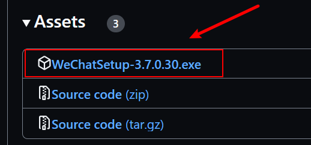

# 一、简单介绍

两个字：二改。原作者[ljc545w](https://github.com/ljc545w)

### 用简短的一句话来形容这个二改？

> emmm，能跑起来 !

### 那请你正经点回答，这个是干毛的？

> 咳咳，如果你不知道，那么这个项目不适合你。\
> 好吧，告诉你，简称：**<font color="red">微信机器人阅读自动过检测</font>**

### 那这个项目的运行原理逻辑是啥？

> 1. 通过 Hook PC微信的方式，监听 WxPusher 公众号发送的检测文章通知
> 2. 自动提取其链接，并使用对应账号的微信打开内置浏览器访问（没错，大佬的项目可以多开微信）

### 有没有简单一点的使用步骤？

> 1. 打开微信（可以运行此项目中的`多开微信.py`文件）并登录
> 2. 运行`微信机器人.py`
> 3. 以上步骤不是对的🤓

# 二、使用教程

## 1. 安装python环境

安装教程网络上一大堆，自行google学习

版本随意，不过可别给我安装python2版本的了，报错了我可不负责

本人云桌面安装的是 `python3.11.8`, 顺便贴上其下载地址: [下载页面](https://www.python.org/downloads/release/python-3118/)


## 2. 安装 VSCode

安装教程网上也一大堆，我这里仅贴出官网地址：[VSCode]( https://code.visualstudio.com/)

只要你电脑上能运行，跑得动python，那就可以，和开发软件无关，选择自己喜欢的就行

我推荐`vscode`的原因是因为它比较轻量级

是这个小蓝朋友，别搞错了!


## 3. 安装指定微信版本

本人安装的是`3.0.7.30`
，没有此版本的可以前往[3.0.7.30](https://github.com/tom-snow/wechat-windows-versions/releases/tag/v3.7.0.30)下载



## 4. 下载本项目到本地

### (1) 切换到 `log`分支


### (2) 下载

**类似下方这样**


### 解压缩什么的就不用多说了吧

### (3) 注入

打开解压后的文件夹，找到`depends`文件夹，双击`install.bat`安装

Tips: 如果想卸载，可以双击`uninstall.bat`文件

正常情况的显示如下：


如果报错（时间过太久忘记是什么报错了），可能是dll依赖缺少或异常，dll修复工具进行修复一下

本项目中已经上传，解压即可，里面有一个压缩包和一个exe可执行文件，先执行exe，在解压压缩包，最后再运行解压后文件夹中的程序


修复完成后请重启计算机

**<font color="red"> 如果仍然注入失败，请自行google解决问题，或者该项目不适合你</font>**

## 4. 在 `VSCode` 中打开此项目

### （1）看左上角、左上角


### （2）接下来选择你刚刚解压的文件夹

### （3）安装python扩展


### （4）配置python解释器环境


总之会显示下图中的内容，此时**选择第一个，创建虚拟环境**


右下角会显示如图，等待亿会儿会儿即可


右下角显示如下图，即表示成功


## 5. 运行程序

小白能到这里真不容易，给你点个赞吧👍, 算了还是给我小⭐⭐吧

### (1) 多开微信


### <font color="red">【注意】！！！不要使用电脑上提供的右击退出微信，会导致所有微信进程被关闭！！！</font>


### （2）运行机器人


当显示“开始接收消息”，就表示机器人已经处于运行状态了

此时显示多少个“开始接收消息”，就表示已经双开了多少个微信，前面会显示当前微信绑定的手机号，没有绑定就不会显示

### ok，教程到此结束。如果你有所收获，可以给我⭐
### 算了，不演了，对！没错！打劫😎！给我⭐！🥳🥳🥳

# 三、致谢

感谢[ljc545w](https://github.com/ljc545w)大佬作出的贡献

感谢[JustUndertaker](https://github.com/JustUndertaker)
大佬的开源项目[ComWeChatBotClient](https://github.com/JustUndertaker/ComWeChatBotClient)


----

# 从这开始，下方内容由原作者撰写

# 描述

PC微信机器人，实现以下功能：

1. 获取通讯录
2. 发送文本、图片、文件、xml文章、名片、群艾特消息
3. 根据wxid查询好友信息
4. 根据群ID获取所有群成员wxid
5. 检测好友状态（是否好友、被删除、被拉黑）
6. 接收各类消息，可写回调函数进行处理
7. 封装COM接口，方便使用自己喜欢的语言进行调用
8. 群管理
9. 微信多开

# 用途

1. 淘客发单
2. 无痕清粉
3. 微信公众号采集
4. 聊天记录备份
5. 其他你能想到的用途

# 可用版本

微信电脑版**3.5.0.46**  
微信电脑版**3.6.0.18**  
微信电脑版**3.7.0.26**  
微信电脑版**3.7.0.30**  
主分支对应微信3.7.0.30版本，其他版本请查看对应分支。

# 编译环境

**Visual Studio 2019**(平台配置：win32(x86))

# 原理

通过逆向PC微信，定位到关键CALL，dll内联汇编调用  
注册32位COM组件，供64位/32位进程外部调用

# 目录说明

`./CWeChatRobot`：COM组件的实现代码  
`./DWeChatRobot`：注入的DLL实现代码，根据平台配置可编译出socket版和COM版  
`./old_projects`:  包含C#的调用示例以及3.7.0.26版本的E语言调用  
`./Python`：python示例和接口测试文件  
`./wxDriver`：driver的实现代码

下载二进制文件请到：[Release](https://github.com/ljc545w/ComWeChatRobot/releases)

# 快速启动

以管理员权限执行以下命令：

```shell
# 安装
CWeChatRobot.exe /regserver
# 卸载
CWeChatRobot.exe /unregserver
```

# 调用

**Python：**  
参考[wxRobot.py](/Python/com/wxRobot.py)  
**C#：**  
参考[ComWechatRobotCsharp](https://github.com/RingoStudio/ComWechatRobotCsharp)，感谢@RingoStudio 的贡献  
**易语言：**  
参考[ESDK](/old_projects/ESDK)，感谢@lovezm 的贡献

# 更多功能

1. 尝试添加issue中的功能

有空的时候会按照上述顺序进行开发，不过嘛，计划只是计划，如果未实现也请见谅
**也欢迎您提交PR**

# 更新记录

## 2022.04.01

1. 使用SAFEARRAY返回通讯录列表，可正确显示好友昵称中的特殊符号
2. README中添加目录说明
3. 更新C#示例代码，添加好友列表的遍历示例

## 2022.04.11

1. 修改获取个人信息接口和发送文章接口，兼容老版wxid（未经测试，如有问题请提ISSUE）
2. 添加接收消息的接口，可以写回调对消息进行处理（参考Python示例文件）

## 2022.04.12

1. 添加发送群艾特消息的接口

## 2022.04.12

1. 添加通过群ID获取所有群成员wxid接口

## 2022.04.13

1. 更新群艾特接口，可同时艾特多人

## 2022.04.18

1. 添加获取数据库句柄接口（部分句柄，获取全量句柄需Hook）
2. 添加执行SQL命令接口
3. 添加在线数据库备份接口

## 2022.06.01

1. 适配微信**3.7.0.26**版本，部分功能未经测试，如有问题请报issue

## 2022.06.02

1. 添加通过好友申请接口（配合接收消息接口可自动通过好友）
2. 添加获取聊天记录数据库句柄（好友申请消息类型为0x25）
3. 优化了StartService接口，重复注入时不再关闭远程进程

## 2022.06.04

1. 完成通过wxid和v3数据加好友的COM接口（后续添加通过微信号、手机号、QQ号查询V3数据接口）
2. 优化接收消息逻辑，添加消息时间；新增Hook发送消息，返回数据中以一个BOOL值区分发送和接收
3. 修复了一个BUG，该BUG可能导致Release配置下，COM接口无法正常加载DWeChatRobot.dll计算偏移

## 2022.06.07

1. 添加获取当前微信版本（读注册表）和启动微信的接口
2. 优化数据库查询接口，现在可以正常查询BLOB类型

## 2022.06.10

1. 新增关注公众号、网络查询用户信息、Hook语音、未加密图片、自定义微信版本号接口
2. Hook语音和图片的接口暂时还有瑕疵，图片收到后有可能不会自动下载；语音消息的文件名暂时是时间戳，计划替换为该条消息id。有空再做优化。

## 2022.06.13

1. 优化发送艾特消息接口，新增一个参数，指示是否自动填充被艾特人昵称
2. 优化发送文章消息接口，新增一个参数，用于展示消息卡片缩略图
3. 新增删除好友接口
4. 新增发送小程序接口

## 2022.06.18

1. 修复了多个BUG
2. 整理代码结构，方便后续开发基于websocket的接口
3. 添加64位程序注入DLL到32位程序的driver

## 2022.06.24

1. 解决Python脚本中，socket接收数据可能不完整的问题
2. 解决心跳时如果同步了同一个人的多条消息，只会返回一条的问题
3. 感谢@shangdev 提供的思路，现在开启hook图片的时会修改自动下载图片时段为全天

## 2022.06.30

1. 已适配3.7.0.30版本

## 2022.07.19

1. 新增修改备注接口
2. 新增群管理功能，包括添加成员、删除成员、设置公告、修改群名称、设置群内个人昵称、获取群成员昵称

## 2022.07.24

1. 添加多开管理

## 2022.07.28

1. 解决部分已知问题，优化多开管理
2. 重构COM中的部分实现

## 2022.08.13

1. 现在消息HOOK内容包含消息ID
2. 完成发送消息的http接口，可参考[wxDriver.py](/Python/http/wxDriver.py)，其他接口还需要一点时间
3. 新增项目配置文件，感谢@amchii 提供的方法

## 2022.08.21

1. 所有功能http接口封装完成，可接受get、post请求
2. 提供http接口调用示例，参考[wxDriver.py](/Python/http/wxDriver.py)

## 2022.08.25

1. 接收消息格式修改为json，现在也可以获取到扩展信息，可从扩展信息中获取到文件保存路径或被艾特人wxid
2. 优化获取个人信息，获取好友信息接口

## 2022.09.09

1. 新增打开微信内置浏览器的功能
2. 新增获取公众号历史消息功能（具体能获取多少未测试，请谨慎使用，以防封号）
3. 修复了一个bug，该bug会导致图片和语音保存到微信安装目录而非指定的目录
4. 优化实时消息接口，现在会带上自己的wxid
5. 优化图片和语音保存路径，方便区分来自不同账号的消息

## 2022.09.10

1. 中秋节快乐
2. 新增转发消息功能，请勿转发语音、红包等消息
3. 实时消息接口新增`localId`字段，该字段用于转发消息接口；现在也可以接收到撤回消息提醒
4. 优化COM连接点，在线程中进行消息广播，客户端可以阻塞以等待图片、语音等资源落地

## 2022.09.18

1. 修复了一个bug，在多个MSG.db存在时，无法转发准确的消息；现在转发消息功能使用msgid作为参数
2. 修复了一个bug，该bug曾导致微信没有选中的会话时，无法获取实时消息
3. 修复了一个bug，该bug曾导致部分微信号获取个人信息时出现内存访问冲突
4. 优化实时消息接口，不再返回localId字段；extrabuf现在返回原始信息而不是base64编码数据；新增一个字段，用于区分是否手机发送的消息（接收到的消息不含该字段）
5. 优化个人信息接口，现在可以返回个人文件夹路径
6. 优化群艾特接口，优先填充群内昵称
7. 新增获取二维码接口，调用该接口时会切换到二维码登录

## 2022.09.22

1. 新增获取a8key功能
2. 修复了一个bug，该bug曾导致获取数据库句柄接口只能生效一次

## 2022.09.27

1. 优化转发消息接口、获取数据库句柄接口，实时消息添加原始时间戳

## 2022.10.07

1. 新增发送原始xml接口
2. 新增退出登录接口
3. 尝试修复文件发送失败和格式化时间戳导致崩溃问题
4. 实时消息新增一个字段，用于获取视频消息缩略图保存位置

## 2022.10.16

1. 新增收款接口
2. 实时消息接口优化，支持获取音视频聊天信息，支持获取手机端切换联系人时的提示信息
3. 修复部分已知问题

## 2022.11.2

1. 支持发送动态表情
2. 支持夜间自动下载视频（需开启一次实时消息监听）
3. 新增通过消息id下载消息附件功能

# 打赏作者

请给作者一个star，感谢感谢

# 免责声明

代码仅供交流学习使用，请勿用于非法用途和商业用途！如因此产生任何法律纠纷，均与作者无关！
